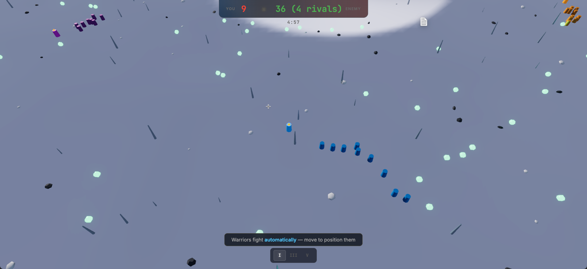

# Crawnfall — War Serpent Arena



> **A real-time warband strategy arena** set on a snowy alien planet — built entirely through AI-assisted development to showcase the power of modern LLMs and well-crafted prompt engineering.

<!-- PLAYABLE GAME LINK -->
<!-- TODO: Replace with actual deployment URL -->
**[▶ Play Crawnfall Now](https://crawnfall.vercel.app/)**

---

## What Is This?

Crawnfall is a fully playable, cross-platform game created to demonstrate what's possible when you combine **current-generation Large Language Models** with **precise, well-structured prompts** and **good orchestration**. The entire codebase — ECS architecture, combat systems, AI personalities, procedural terrain, Three.js rendering pipeline — was generated from a single master prompt.

This project isn't a toy demo. It's a complete game with deep mechanics, performant rendering, and a production-grade architecture.

---

## The Game

Command a **War Serpent** — a leader who draws a growing warband of warriors across a frozen alien world. Collect glowing essence shards to recruit soldiers, clash with enemy warbands in formation-based combat, hunt down rival leaders for their crowns, and absorb fallen armies to dominate the arena.

<video src="assets/media/crawnfall_gameplay.mp4" controls width="100%">
  Your browser does not support the video tag. <a href="assets/media/crawnfall_gameplay.mp4">Download the gameplay video</a>.
</video>

### Core Loop

1. **Move** — Click the terrain to lead your warband. Warriors follow in formation (Column, Line, or Wedge).
2. **Collect** — Essence shards are scattered across the map. Walk near them to recruit new warriors into your army.
3. **Fight** — Warbands auto-engage. Warriors hold at attack range, forming distinct battle lines instead of chaotic blobs.
4. **Crown** — Kill an enemy leader to drop their Crown. Pick it up to absorb their entire army.
5. **Win** — Last leader standing, total annihilation, or largest army when the 5-minute timer expires.

### What Makes It Interesting

| Feature | Details |
|---------|---------|
| **Formation Combat** | Column, Line, and Wedge formations with physics-based flocking and distinct battle-line behavior |
| **Crown Mechanic** | Defeated leaders drop their crown — pick it up to absorb their warriors and glow brighter |
| **4 AI Personalities** | Aggressive (Red), Cautious (Green), Balanced (Orange), and Farmer (Purple) with distinct state machines |
| **Morale & Flanking** | Warriors have cohesion stats. Flanking attacks deal bonus damage and morale penalties. Broken morale causes scattering |
| **Map Shrink** | Battle royale-style zone collapse forces confrontation after 3 minutes |
| **Shard Economy** | Net-zero death economy — each killed warrior drops exactly 1 shard, preventing exponential growth |

---

## Screenshot


---

## Architecture

The game is built as a monorepo with a clean separation between platform-agnostic game logic and rendering:

```
crawnfall/
├── packages/
│   ├── game-core/          # Pure TypeScript — ECS, systems, events, configs
│   │   ├── ecs/            # World, ComponentStore, entity management
│   │   ├── components/     # Plain data interfaces (Transform, Health, Team, etc.)
│   │   ├── systems/        # MovementSystem, CombatSystem, AISystem, ShardSystem, CrownSystem
│   │   ├── events/         # Strongly-typed EventBus with 20+ game events
│   │   └── data/           # GameConfig with all balance parameters
│   └── game-web/           # Three.js renderer, camera, input, HUD
│       ├── renderer/       # SceneManager, EntityRenderer, TerrainGenerator, VegetationSystem
│       ├── camera/         # RTSCamera with WASD pan, zoom, leader follow
│       ├── input/          # Click-to-move with terrain raycasting
│       └── ui/             # HUD overlay, SettingsMenu, match end screen
├── apps/
│   ├── mobile/             # Capacitor shell (iOS + Android)
│   └── desktop/            # Electron shell (Steam-ready)
└── package.json            # NPM workspaces root
```

### Design Decisions

| Principle | Implementation |
|-----------|---------------|
| **Deterministic simulation** | Fixed 20-tick/s loop with seeded PRNG (Mulberry32) |
| **Event-driven economy** | Army counts change only on `WarriorJoined` / `UnitDied` events — never timers |
| **ECS architecture** | Numeric entity IDs, plain data components, stateless systems |
| **Platform-agnostic core** | `game-core` has zero DOM/browser/Three.js dependencies |
| **Single build output** | `game-web` dist is shared by Web, Capacitor, and Electron |

### Rendering Stack

- **Three.js** with `MeshStandardMaterial` (PBR workflow)
- **Custom GLSL terrain shader** — slope-based snow/rock blending, value noise, vertex AO, fog
- **Procedural sky** — gradient from dark starfield to blue-gray horizon with atmospheric haze
- **InstancedMesh vegetation** — ice crystal spires, dark rocks, snow mounds at zero draw-call cost
- **Postprocessing** — RenderPass → FXAA → UnrealBloomPass → OutputPass
- **ACES Filmic tone mapping** with directional sunlight, hemisphere ambient, and cool fill lighting

---

## How It Was Built

This game was generated using a **~500-line master prompt** ([CrawnfallPrompt.md](./CrawnfallPrompt.md)) that specifies:

- Complete game concept and mechanics
- Visual target with exact geometry parameters and shader requirements
- Full ECS architecture with component keys and system responsibilities
- AI personality matrix with state machine transitions
- Cross-platform packaging strategy
- Performance and memory management requirements
- Acceptance criteria for correctness

The prompt was designed to be **precise enough that an LLM could produce a working game** without ambiguity, while remaining readable as a specification document. No iterative back-and-forth — the structure of the prompt itself is what makes the output work.

### Why This Matters

Most AI-generated code demos are trivial — a TODO app, a landing page, a chatbot wrapper. This project demonstrates that with the right prompt engineering and orchestration, LLMs can produce:

- **Complex systems** (ECS, event-driven architecture, AI state machines)
- **Real-time rendering** (Three.js with custom shaders, postprocessing, instanced rendering)
- **Balanced game design** (net-zero economy, morale mechanics, formation combat)
- **Production-grade structure** (monorepo, TypeScript, cross-platform packaging)

---

## Running Locally

### Prerequisites

- **Node.js** ≥ 20
- **npm** ≥ 10

### Quick Start

```bash
# Clone the repository
git clone https://github.com/codavidgarcia/Crawnfall.git
cd Crawnfall

# Install all dependencies
npm install

# Start the dev server
npm run dev:web

# Open http://localhost:3000 and play
```

### Controls

| Input | Action |
|-------|--------|
| **Left click** | Move your warband |
| **WASD / Arrows** | Pan camera |
| **Scroll wheel** | Zoom in/out |
| **1 / 2 / 3** | Formation: Column / Line / Wedge |
| **Escape** | Settings menu |

---

## Building for Other Platforms

### Web (Production)

```bash
npm run build:web
# Output: packages/game-web/dist/
```

### Mobile (Capacitor)

```bash
npm run build:web
cd apps/mobile
npx cap sync

# iOS
npx cap open ios

# Android
npx cap open android
```

### Desktop (Electron)

```bash
# Development
npm run dev:web          # Terminal 1
npm run dev:desktop      # Terminal 2

# Package for distribution
npm run build:web
npm run package:desktop
# Output: apps/desktop/out/
```

---

## Performance

| Platform | Target | Approach |
|----------|--------|----------|
| Desktop | 60 FPS | Full quality — 4096 shadow maps, bloom, max vegetation |
| Mobile | 30–60 FPS | Scaled resolution, 1024 shadows, reduced vegetation density |

Graphics quality presets (Low / Medium / High / Ultra) control shadow resolution, bloom, vegetation density, resolution scale, and max lights.

---

## Tech Stack

| Layer | Technology |
|-------|-----------|
| Language | TypeScript (strict mode) |
| Game Engine | Custom ECS + Three.js |
| Bundler | Vite |
| Mobile | Capacitor (iOS + Android) |
| Desktop | Electron (Steam-ready) |
| Monorepo | NPM Workspaces |

---

## License

MIT
